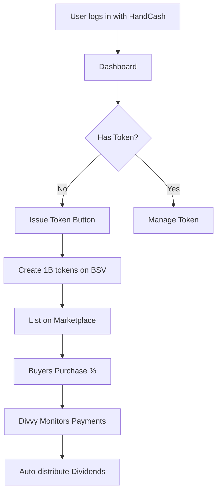

# Divvy Architecture - Complete Token Dividend System

## System Overview

Divvy is a dividend distribution system that allows HandCash users to tokenize their payment stream. When users issue tokens for their HandCash handle, they're essentially selling future dividend rights to payments received by that handle.

## Core Components

### 1. User Flow



### 2. Token Issuance Process

When a user decides to "Divvy up" their HandCash handle:

1. **Token Creation**
   - Mint 1,000,000,000 tokens on BSV blockchain
   - Token symbol: $HANDLE (from @handle)
   - All tokens initially owned by issuer
   - Permanent commitment to dividend distribution

2. **Legal Agreement**
   - User agrees to route ALL payments through Divvy
   - Irrevocable smart contract commitment
   - Transparency for token buyers

3. **Initial Listing**
   - Minimum sale unit: 200,000 tokens (0.02%)
   - User sets initial price
   - Listed on internal marketplace + 1sat.market

### 3. Payment Distribution Architecture

```javascript
// Conceptual flow
async function processIncomingPayment(payment) {
  // 1. Detect payment to monitored HandCash handle
  const { handle, amount, txId } = payment;
  
  // 2. Query token ownership distribution
  const tokenHolders = await getTokenHolders(handle);
  // Example: [
  //   { address: 'issuer_address', percentage: 95 },
  //   { address: 'buyer1_address', percentage: 5 }
  // ]
  
  // 3. Calculate distributions
  const distributions = tokenHolders.map(holder => ({
    recipient: holder.address,
    amount: (amount * holder.percentage) / 100
  }));
  
  // 4. Execute payments
  for (const dist of distributions) {
    await sendPayment(dist.recipient, dist.amount);
  }
}
```

### 4. Technical Implementation Options

#### Option A: Custodial Wallet (Simplest)
```javascript
// Divvy controls a business wallet
const divvyWallet = {
  appId: process.env.HANDCASH_APP_ID,
  appSecret: process.env.HANDCASH_APP_SECRET
};

// User grants permission to receive payments
async function setupUserDivvy(userHandle) {
  // Create payment webhook
  await handcash.createWebhook({
    handle: userHandle,
    url: 'https://divvy.app/webhook/payment',
    events: ['payment.received']
  });
}

// Process incoming payments
async function handlePaymentWebhook(webhook) {
  const { handle, amount } = webhook.data;
  
  // Get token distribution
  const holders = await db.getTokenHolders(handle);
  
  // Send from Divvy business wallet
  for (const holder of holders) {
    await handcash.pay({
      destination: holder.handle,
      amount: holder.share,
      currencyCode: 'USD'
    });
  }
}
```

#### Option B: Pre-signed Transactions (More Secure)
```javascript
// User pre-signs distribution templates
async function createDistributionTemplate(userAuthToken) {
  // User signs a template for future distributions
  const template = await handcash.createPaymentTemplate({
    authToken: userAuthToken,
    recipients: 'DYNAMIC', // Filled in later
    maxAmount: 'UNLIMITED',
    validUntil: 'PERMANENT'
  });
  
  // Store encrypted template
  await db.saveTemplate(template);
}
```

#### Option C: Smart Contract (Most Decentralized)
```javascript
// BSV smart contract handles distribution
class DividendContract extends SmartContract {
  @prop()
  tokenId: ByteString;
  
  @prop()
  holders: Map<PubKey, bigint>; // address -> token amount
  
  @method()
  public distributePayment(payment: bigint) {
    // Calculate each holder's share
    const totalSupply = 1000000000n;
    
    for (const [address, balance] of this.holders) {
      const share = (payment * balance) / totalSupply;
      // Send BSV to address
      this.outputs.push({
        address: address,
        satoshis: share
      });
    }
  }
}
```

### 5. Database Schema Updates

```prisma
model DivvyRegistration {
  id              String   @id @default(cuid())
  userId          String   @unique
  handcashHandle  String   @unique
  tokenId         String   @unique
  
  // Payment routing
  webhookId       String?  // HandCash webhook ID
  businessWallet  String?  // If using custodial
  templateId      String?  // If using pre-signed
  contractAddress String?  // If using smart contract
  
  // Statistics
  totalReceived   Decimal  @default(0)
  totalDistributed Decimal @default(0)
  
  createdAt       DateTime @default(now())
  updatedAt       DateTime @updatedAt
  
  user            User     @relation(fields: [userId], references: [id])
  token           Token    @relation(fields: [tokenId], references: [id])
}

model PaymentEvent {
  id              String   @id @default(cuid())
  handcashHandle  String
  
  // Incoming payment
  incomingTxId    String
  incomingAmount  Decimal
  
  // Distribution status
  status          String   // PENDING, PROCESSING, COMPLETED, FAILED
  distributions   Json     // Array of {address, amount, txId}
  
  createdAt       DateTime @default(now())
  completedAt     DateTime?
}
```

### 6. User Dashboard Components

```typescript
// Dashboard page structure
interface DashboardProps {
  user: User;
  token?: Token;
  divvyStatus?: DivvyRegistration;
}

export function Dashboard({ user, token, divvyStatus }: DashboardProps) {
  if (!token) {
    return <TokenIssuanceFlow />;
  }
  
  if (!divvyStatus) {
    return <DivvySetupFlow token={token} />;
  }
  
  return <TokenManagementDashboard 
    token={token} 
    divvyStatus={divvyStatus} 
  />;
}
```

### 7. 1sat.market Integration

```typescript
// Integration with 1sat ordinals marketplace
import { OneSatSDK } from '@1sat/sdk';

async function listTokenOn1Sat(token: Token) {
  const listing = await OneSatSDK.createListing({
    inscriptionId: token.inscriptionId,
    price: token.initialPrice,
    amount: 200000, // Minimum tranche
    seller: token.owner
  });
  
  // Sync with our database
  await db.tokenListing.create({
    tokenId: token.id,
    platform: '1SAT',
    listingId: listing.id,
    status: 'ACTIVE'
  });
}
```

### 8. Security Considerations

#### Critical Security Requirements
1. **Private Key Management**
   - Never store user's HandCash private keys
   - Use OAuth tokens with limited scope
   - Implement key rotation for business wallet

2. **Payment Verification**
   - Verify all incoming payments on-chain
   - Implement idempotency for distributions
   - Audit trail for all transactions

3. **Access Control**
   - Only token issuer can modify distribution rules
   - Rate limiting on payment processing
   - Multi-sig for large distributions

#### Implementation Safeguards
```typescript
// Payment processing with safeguards
async function securePaymentDistribution(payment: Payment) {
  // 1. Verify payment on blockchain
  const verified = await verifyOnChain(payment.txId);
  if (!verified) throw new Error('Payment not verified');
  
  // 2. Check for duplicate processing
  const processed = await db.paymentEvent.findUnique({
    where: { incomingTxId: payment.txId }
  });
  if (processed) return; // Already handled
  
  // 3. Lock for processing
  const lock = await acquireLock(`payment:${payment.txId}`);
  
  try {
    // 4. Calculate and execute distributions
    await processDistributions(payment);
  } finally {
    await releaseLock(lock);
  }
}
```

### 9. Monitoring & Automation

```typescript
// Background service for payment monitoring
class DivvyMonitorService {
  async start() {
    // Monitor registered HandCash handles
    const registrations = await db.divvyRegistration.findMany({
      where: { active: true }
    });
    
    for (const reg of registrations) {
      // Set up webhook listener
      await this.setupWebhook(reg);
      
      // Fallback: Poll for payments
      setInterval(() => this.checkPayments(reg), 60000);
    }
  }
  
  async handleIncomingPayment(webhook: Webhook) {
    const payment = webhook.data;
    
    // Queue for processing
    await queue.add('process-payment', {
      handle: payment.handle,
      amount: payment.amount,
      txId: payment.txId
    });
  }
}
```

### 10. Implementation Phases

#### Phase 1: MVP (Custodial)
- Divvy business wallet handles distributions
- Manual approval for large payments
- Basic monitoring dashboard

#### Phase 2: Enhanced Security
- Pre-signed transaction templates
- Automated distribution
- Real-time monitoring

#### Phase 3: Full Decentralization  
- Smart contract-based distribution
- On-chain token tracking
- No custodial requirements

## Technical Stack

### Backend Services
- **Payment Monitor**: Node.js service with HandCash SDK
- **Distribution Engine**: Queue-based processor (Bull/Redis)
- **Blockchain Service**: BSV node integration
- **API Server**: Next.js API routes

### Infrastructure
- **Database**: PostgreSQL for state management
- **Queue**: Redis + Bull for job processing
- **Cache**: Redis for token holder snapshots
- **Monitoring**: Grafana + Prometheus

### External Integrations
- **HandCash Connect**: OAuth + Payment APIs
- **1sat.market**: Token listing and trading
- **BSV Network**: Token minting and transfers
- **WhatsOnChain**: Transaction verification

## Deployment Architecture

```yaml
services:
  web:
    image: cashhandletoken/web
    environment:
      - DATABASE_URL
      - HANDCASH_APP_ID
      - HANDCASH_APP_SECRET
    
  divvy-monitor:
    image: cashhandletoken/divvy-monitor
    environment:
      - REDIS_URL
      - BSV_NODE_URL
    
  divvy-processor:
    image: cashhandletoken/divvy-processor
    replicas: 3
    environment:
      - QUEUE_CONCURRENCY=10
      
  redis:
    image: redis:alpine
    
  postgres:
    image: postgres:14
```

## Cost Analysis

### Per User Costs
- Token minting: ~$0.10 (BSV fees)
- Payment monitoring: ~$0.01/payment
- Distribution fees: ~$0.05/distribution
- Total: ~$0.16 per dividend cycle

### Platform Costs
- Infrastructure: ~$200/month
- BSV node: ~$100/month
- Monitoring: ~$50/month
- Total: ~$350/month base cost

## Next Steps

1. **Implement custodial MVP**
   - Set up HandCash business account
   - Build payment webhook receiver
   - Create distribution engine

2. **Test with $NINJAPUNKGIRLS**
   - Issue token for @NinjaPunkGirls
   - Process test payments
   - Verify distributions

3. **1sat.market Integration**
   - Study their API documentation
   - Implement listing interface
   - Sync trading data

4. **Security Audit**
   - Review key management
   - Test distribution logic
   - Implement monitoring

This architecture provides a clear path from MVP to fully decentralized dividend distribution, with the flexibility to start simple and evolve based on user needs and regulatory requirements.