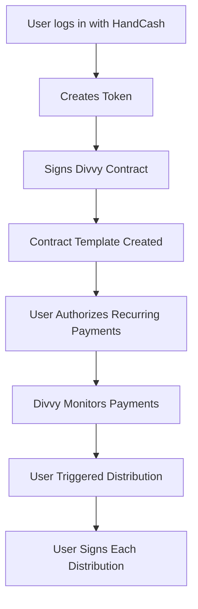

# Divvy Non-Custodial Architecture

## Core Principle: User Sovereignty

Each user maintains full control of their HandCash handle and must personally authorize the Divvy dividend distribution logic. The platform facilitates but never controls user funds.

## How It Actually Works

### 1. User Authorization Flow



### 2. The Reality: User-Signed Transactions

#### Step 1: Token Creation & Divvy Agreement
```typescript
// When user enables Divvy, they sign a contract/agreement
async function enableDivvy(userAuthToken: string) {
  // User signs a Divvy authorization
  const divvyAuthorization = {
    handle: '@UserHandle',
    tokenId: 'token_123',
    agreement: 'I authorize Divvy to help me distribute payments proportionally',
    rules: {
      minimumHolding: 200000,
      distributionMethod: 'proportional',
      frequency: 'on_payment_received'
    }
  };
  
  // Store the agreement (NOT the auth token)
  await db.divvyAgreement.create({
    data: {
      ...divvyAuthorization,
      signedAt: new Date()
    }
  });
}
```

#### Step 2: Payment Detection & Distribution Preparation
```typescript
// Divvy detects payment and PREPARES distributions
async function prepareDistributions(payment: IncomingPayment) {
  // Calculate who gets what
  const distributions = calculateDistributions(payment);
  
  // Create pending distribution batch
  const batch = await db.distributionBatch.create({
    data: {
      handcashHandle: payment.handle,
      incomingAmount: payment.amount,
      distributions: distributions,
      status: 'AWAITING_SIGNATURE'
    }
  });
  
  // Notify user they need to sign
  await notifyUserToSign(payment.handle, batch.id);
}
```

#### Step 3: User Signs Distribution
```typescript
// User must sign each distribution batch
async function userSignsDistribution(
  userAuthToken: string, 
  batchId: string
) {
  const batch = await db.distributionBatch.findUnique({
    where: { id: batchId }
  });
  
  // User reviews and signs
  const signedTransactions = [];
  
  for (const dist of batch.distributions) {
    // User's HandCash wallet signs each payment
    const signedTx = await handCashConnect.createPayment({
      authToken: userAuthToken, // User's auth, not ours
      destination: dist.recipientHandle,
      amount: dist.amount,
      note: `Dividend from ${batch.handcashHandle}`
    });
    
    signedTransactions.push(signedTx);
  }
  
  // Execute all signed transactions
  await executeSignedTransactions(signedTransactions);
}
```

### 3. Implementation Options

#### Option A: Manual Approval (MVP)
- User gets notification: "You have payments to distribute"
- User logs into dashboard
- Reviews distribution breakdown
- Clicks "Approve & Send" 
- HandCash opens to sign transactions
- Payments sent

#### Option B: Pre-Authorized Templates
```typescript
// User pre-authorizes a payment template
async function createPaymentTemplate(userAuthToken: string) {
  // User signs a recurring payment authorization
  const template = await handCashConnect.createRecurringPayment({
    authToken: userAuthToken,
    template: {
      type: 'PERCENTAGE_BASED',
      maxAmount: 'unlimited', // Or user-defined limit
      validUntil: '2025-12-31',
      recipients: 'DYNAMIC_FROM_TOKEN_HOLDERS'
    }
  });
  
  // Store template reference (not keys!)
  await db.paymentTemplate.create({
    data: {
      templateId: template.id,
      handcashHandle: user.handle,
      // No auth tokens stored!
    }
  });
}
```

#### Option C: Smart Contract (Most Automated)
```javascript
// BSV Script or sCrypt contract
class DivvyContract {
  constructor(
    public tokenId: string,
    public ownerPubKey: PubKey,
    public minimumHolding: bigint
  ) {}
  
  // User signs this contract ONCE
  @method()
  public distribute(
    payment: bigint,
    holders: Map<PubKey, bigint>,
    ownerSig: Sig
  ) {
    // Verify owner signature
    assert(this.checkSig(ownerSig, this.ownerPubKey));
    
    // Distribute according to holdings
    const totalSupply = 1000000000n;
    for (const [holderKey, balance] of holders) {
      if (balance >= this.minimumHolding) {
        const share = (payment * balance) / totalSupply;
        // Create output for holder
        this.buildOutput(holderKey, share);
      }
    }
    
    return true;
  }
}
```

### 4. The User Experience

#### For $NINJAPUNKGIRLS (You)
```typescript
// You control @NinjaPunkGirls handle
const ninjaPunkFlow = {
  step1: "Create $NINJAPUNKGIRLS token",
  step2: "Sign Divvy distribution contract",
  step3: "When payment received, sign distribution batch",
  step4: "Payments automatically sent to holders"
};
```

#### For Other Users
```typescript
// They control their own handles
const userFlow = {
  step1: "Create token for @TheirHandle",
  step2: "Sign their own Divvy contract",
  step3: "They sign distributions for their payments",
  step4: "They maintain full control"
};
```

### 5. Dashboard Updates for Signing

```typescript
// Updated dashboard component
export function DivvyDistributionPanel({ user, pendingBatches }) {
  return (
    <div className="bg-gray-800 rounded-lg p-6">
      <h3 className="text-xl font-bold text-white mb-4">
        Pending Distributions
      </h3>
      
      {pendingBatches.map(batch => (
        <div key={batch.id} className="mb-4 p-4 bg-gray-700 rounded">
          <p className="text-white">
            Incoming: ${batch.amount} from {batch.fromHandle}
          </p>
          <p className="text-gray-300">
            Distribute to {batch.holderCount} holders
          </p>
          
          <button
            onClick={() => signDistribution(batch.id)}
            className="mt-2 bg-blue-600 hover:bg-blue-700 text-white px-4 py-2 rounded"
          >
            Review & Sign Distribution
          </button>
        </div>
      ))}
      
      {pendingBatches.length === 0 && (
        <p className="text-gray-400">No pending distributions</p>
      )}
    </div>
  );
}

async function signDistribution(batchId: string) {
  // Opens HandCash for user to sign
  const result = await handCashConnect.requestSignature({
    type: 'BATCH_PAYMENT',
    batchId: batchId,
    message: 'Sign to distribute dividends to token holders'
  });
  
  if (result.signed) {
    // Execute the distribution
    await fetch('/api/divvy/execute', {
      method: 'POST',
      body: JSON.stringify({ 
        batchId, 
        signature: result.signature 
      })
    });
  }
}
```

### 6. Security & Trust Model

#### What Divvy Does:
- ✅ Monitors blockchain for payments
- ✅ Calculates fair distributions
- ✅ Prepares transaction templates
- ✅ Provides signing interface
- ✅ Tracks distribution history

#### What Divvy CANNOT Do:
- ❌ Access user funds
- ❌ Sign transactions for users
- ❌ Move money without authorization
- ❌ Change distribution rules unilaterally
- ❌ Act as custodian

### 7. Implementation Roadmap

#### Phase 1: Manual Signing (Week 1-2)
- User manually approves each distribution
- Simple dashboard interface
- Test with $NINJAPUNKGIRLS

#### Phase 2: Batch Signing (Week 3-4)
- Group multiple distributions
- Single signing session
- Improved UX

#### Phase 3: Template Authorization (Month 2)
- Pre-authorized payment templates
- Recurring distribution rules
- Semi-automated flow

#### Phase 4: Smart Contract (Month 3+)
- On-chain distribution logic
- Fully trustless operation
- Minimal user interaction

### 8. Database Schema for Non-Custodial

```prisma
model DivvyAgreement {
  id              String   @id @default(cuid())
  userId          String   @unique
  handcashHandle  String   @unique
  tokenId         String   @unique
  
  // Agreement details (no keys!)
  agreementHash   String   // Hash of terms
  signedAt        DateTime
  
  // Distribution rules
  minimumHolding  BigInt   @default(200000)
  
  // Template references (if using pre-auth)
  templateId      String?  // HandCash template ID
  templateExpiry  DateTime?
  
  // Smart contract (if deployed)
  contractAddress String?
  
  user            User     @relation(fields: [userId], references: [id])
  token           Token    @relation(fields: [tokenId], references: [id])
}

model DistributionBatch {
  id              String   @id @default(cuid())
  handcashHandle  String
  
  // Incoming payment
  incomingTxId    String
  incomingAmount  Decimal
  fromHandle      String
  
  // Distribution plan
  distributions   Json     // Array of {handle, amount, percentage}
  holderCount     Int
  
  // Status
  status          String   // AWAITING_SIGNATURE, SIGNED, EXECUTED, FAILED
  
  // Execution details
  signedAt        DateTime?
  executedAt      DateTime?
  signatureHash   String?  // Proof of user signature
  
  createdAt       DateTime @default(now())
}
```

### 9. API Endpoints

```typescript
// GET /api/divvy/pending
// Returns pending distributions for logged-in user
export async function GET(request: NextRequest) {
  const user = await getCurrentUser(request);
  
  const pending = await db.distributionBatch.findMany({
    where: {
      handcashHandle: user.handcashHandle,
      status: 'AWAITING_SIGNATURE'
    }
  });
  
  return NextResponse.json(pending);
}

// POST /api/divvy/sign
// User signs a distribution batch
export async function POST(request: NextRequest) {
  const { batchId, authToken } = await request.json();
  const user = await getCurrentUser(request);
  
  // Verify batch belongs to user
  const batch = await db.distributionBatch.findFirst({
    where: {
      id: batchId,
      handcashHandle: user.handcashHandle
    }
  });
  
  if (!batch) {
    return NextResponse.json({ error: 'Batch not found' }, { status: 404 });
  }
  
  // User signs with their own auth token
  // This happens in their browser with their HandCash session
  const result = await executeUserSignedDistribution(authToken, batch);
  
  return NextResponse.json(result);
}
```

### 10. Trust & Legal Considerations

#### User Agreement
When users enable Divvy, they agree to:
- "I authorize Divvy to calculate dividend distributions"
- "I understand I must sign each distribution"
- "I maintain full control of my HandCash handle"
- "Divvy never has access to my private keys"

#### Platform Liability
- Divvy is a calculation and facilitation service
- Users execute their own transactions
- Platform has no custody or control
- Similar to tax software - we calculate, you file

## Conclusion

The non-custodial approach means:
1. **You ($NINJAPUNKGIRLS)** sign distributions for your handle
2. **Other users** sign distributions for their handles
3. **Divvy platform** facilitates but never controls
4. **Everyone** maintains sovereignty over their funds

This is the only legally and technically sound approach for a platform that respects user ownership and complies with regulations.